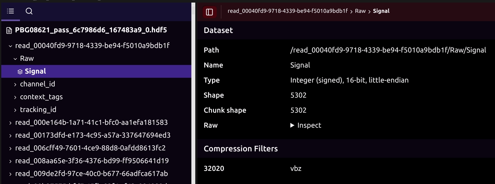

# HDF5压缩算法测试项目

## 📋 项目概述

本项目要求候选人测试HDF5的各种压缩过滤器，找出适合int16信号数据的最优压缩方案。

本项目考察候选人的以下能力：
- **环境搭建能力**：配置开发环境，安装HDF5库及各种压缩过滤器插件
- **新知识学习能力**：学习HDF5文件格式、压缩过滤器使用方法等新知识
- **项目构建能力**：设计项目结构，编写代码实现文件处理、压缩测试等功能

**重要说明**: 
- 本项目不要求自己编写压缩算法，而是调用HDF5已有的压缩过滤器进行数据压缩
- 提供的HDF5文件由于超过100MB限制，已拆分为5个部分（每个小于40MB）
- **文件合并**: 需要先运行合并脚本将拆分文件合并为完整文件
  - Linux/macOS: 运行 `./merge_hdf5.sh`（已测试，兼容 macOS）
  - Windows: 运行 `merge_hdf5.bat`（未测试）
- **VBZ解压**: 原始HDF5文件使用了ONT的VBZ压缩算法，候选人需要自行下载配置VBZ插件（Ubuntu系统可使用 `sudo apt install libvbz-hdf-plugin-dev` 简单安装，或下载配置动态库/源码安装），使用VBZ插件读取并解压原始文件，然后保存为不压缩格式的HDF5文件作为测试基准
- **测试基准**: 以解压后保存的不压缩格式文件作为压缩比计算的基准
- **压缩比定义**: 
  - 公式：压缩比 = 未压缩文件大小 / 压缩后文件大小
  - 示例：如果未压缩文件为100MB，压缩后为50MB，则压缩比为2.0（表示压缩后文件大小是原来的1/2）
- **文件查看**: 可以使用以下工具查看合并后的HDF5文件结构和内容：
  - [HDFView](https://www.hdfgroup.org/download-hdfview/)：图形化工具
  - VSCode的h5web插件
  - HDF5命令行工具（HDF5安装后自带）：
    - `h5dump`：转储HDF5文件内容
    - `h5ls`：列出HDF5文件中的数据集和组
    - `h5stat`：显示HDF5文件的统计信息
    - `h5diff`：比较两个HDF5文件
    - `h5copy`：复制HDF5文件中的对象
    - `h5repack`：重新打包HDF5文件（可改变压缩方式）

## 🎯 项目目标

1. **HDF5文件处理**: 运行合并脚本（Linux/macOS: `./merge_hdf5.sh`，Windows: `merge_hdf5.bat`）合并拆分文件，使用VBZ插件解压原始文件并保存为不压缩格式作为测试基准
2. **压缩测试**: 测试各种HDF5压缩过滤器，记录压缩比（相对于未压缩基准文件）和压缩时间（ms）
3. **结果输出**: 生成测试结果报告（包含测试结果表格和结论分析）

## 🏗️ 技术栈

- **C++11以上**: 主要开发语言
- **CMake**: 构建系统
- **HDF5**: 数据存储格式
- **包管理器**: 可使用vcpkg、conan或其他包管理工具
- **操作系统**: Ubuntu、Windows、macOS（任选其一，但需提供完整的环境配置文档）

## 🚀 环境配置要求

### 环境配置文档（必须提供）

候选人**必须**在项目中提供完整的环境配置文档（如 `docs/ENVIRONMENT_SETUP.md` 或 `INSTALL.md`），包含以下内容：

- **操作系统**: 明确说明使用的操作系统及版本（Ubuntu/Windows/macOS）
- **依赖列表**: 完整的依赖库列表及版本号（HDF5、压缩过滤器插件等）
- **安装步骤**: 详细的安装命令和步骤，包括：
  - 系统基础依赖安装
  - HDF5库安装（说明使用的方式：系统包管理器/vcpkg/源码编译）
  - 压缩过滤器插件安装（VBZ、Blosc2等）
- **环境变量配置**: 所有需要设置的环境变量及配置方法
- **验证步骤**: 如何验证各依赖安装成功的命令
- **常见问题**: 可能遇到的问题及解决方案
- **可复现性**: 确保他人能够根据文档完整复现环境

## 🎯 具体任务要求

### 任务1: 文件处理

**HDF5文件结构说明**: HDF5文件包含多个`read_xxxx`组，每个组下有`Raw/Signal`数据集。压缩和解压操作**仅针对`read_xxxx/Raw/Signal`数据集进行**，其他字段（如`channel_id`、`context_tags`、`tracking_id`等）需要原样保存。

1. **文件合并**: 运行合并脚本将拆分文件合并为完整文件（Linux/macOS: `./merge_hdf5.sh`，Windows: `merge_hdf5.bat`）
2. **VBZ解压**: 使用VBZ插件（Ubuntu系统可使用 `sudo apt install libvbz-hdf-plugin-dev` 简单安装，或下载配置动态库/源码安装）读取合并后的HDF5文件，解压`read_xxxx/Raw/Signal`数据集，其他字段原样保存
3. **基准文件生成**: 将解压后的数据写入未压缩格式的HDF5文件（仅对`read_xxxx/Raw/Signal`数据集不压缩，其他字段保持原样），作为后续压缩比计算的基准

### 任务2: 压缩过滤器测试

**重要说明**: 压缩测试**仅针对`read_xxxx/Raw/Signal`数据集进行**，其他字段（如`channel_id`、`context_tags`、`tracking_id`等）需要原样保存。

**测试要求**: 需要测试以下所有压缩过滤器：

#### 标准HDF5内置过滤器
- GZIP (H5Z_FILTER_DEFLATE)
- SZIP (H5Z_FILTER_SZIP)
- SHUFFLE (H5Z_FILTER_SHUFFLE) - 通常与其他过滤器组合使用

#### 第三方压缩过滤器插件
- VBZ
- Blosc2（可选框架，具有更多功能，有能力的建议尝试）
- Blosc
- LZ4
- ZSTD
- Bitshuffle
- 其他可用的HDF5压缩过滤器插件

#### 压缩级别测试

对于每个压缩过滤器，需要测试三个压缩级别：
- **最低级别**: 最低压缩级别（不是完全不压缩，而是最低压缩设置）
- **中间级别**: 中等压缩级别
- **最高级别**: 最高压缩级别

**注意**: 
- 对于不支持压缩级别的过滤器，测试其可配置参数的不同组合
- 可以测试Shuffle过滤器与其他压缩过滤器的组合使用
- 可以测试不同块大小（chunk size）对压缩效果的影响

### 任务3: 结果输出

**必须提交**: **测试结果报告**，包含以下内容：

1. **测试结果表格**: 包含以下信息的详细测试结果表格

| 压缩过滤器 | 参数配置 | 压缩级别 | 压缩比 | 压缩时间(ms) | 文件大小(MB) | 备注 |
|-----------|---------|---------|--------|-------------|-------------|------|
| None | - | - | 1.0 | XX | XX | 基准（未压缩） |
| GZIP | shuffle=1 | 1 | X.XX | XX | XX | - |
| GZIP | shuffle=1 | 6 | X.XX | XX | XX | - |
| GZIP | shuffle=1 | 9 | X.XX | XX | XX | - |
| LZ4 | - | 1 | X.XX | XX | XX | - |
| LZ4 | - | 3 | X.XX | XX | XX | - |
| LZ4 | - | 9 | X.XX | XX | XX | - |
| ZSTD | - | 1 | X.XX | XX | XX | - |
| ZSTD | - | 6 | X.XX | XX | XX | - |
| ZSTD | - | 19 | X.XX | XX | XX | - |
| ... | ... | ... | ... | ... | ... | ... |

2. **结论分析**: 根据测试结果，分析各压缩过滤器的性能表现，选出最适合int16信号数据的压缩算法和参数配置，并说明选择理由

## 📚 HDF5压缩过滤器资源

以下为可用的HDF5压缩过滤器插件列表，候选人可自行查找和配置：

### 官方资源
- **HDF Group官网**: [https://www.hdfgroup.org/](https://www.hdfgroup.org/)
- **HDF5官方文档**: 压缩过滤器使用指南和API参考

### 压缩过滤器插件
- **VBZ**: [https://github.com/nanoporetech/vbz_compression](https://github.com/nanoporetech/vbz_compression)
  - Ubuntu系统简单安装：`sudo apt install libvbz-hdf-plugin-dev`
  - 或从源码编译安装
- **Blosc2**: [https://github.com/Blosc/c-blosc2](https://github.com/Blosc/c-blosc2)（可选框架，具有更多功能，有能力的建议尝试）
- **Blosc**: Blosc压缩过滤器
- **LZ4**: LZ4压缩过滤器
- **ZSTD**: ZSTD压缩过滤器
- **Bitshuffle**: Bitshuffle压缩过滤器
- 其他第三方HDF5压缩过滤器插件

**说明**: 所有压缩过滤器均为网上公开可用的开源资源，候选人需要自行查找、安装和配置。

## 📞 提交要求

### 代码仓库
- **仓库平台**: 不限制平台，可以是GitHub、Gitee、阿里云效等任何代码仓库平台
- **仓库名**: 可以用任何名字命名（保护答案）
- **仓库地址**: 建立仓库后，请将仓库地址发送至 `zenghui.liu@polyseq.com`
- **仓库设置**: 确保仓库公开，便于评估

### 提交内容
- 完整源代码
- 构建脚本（CMakeLists.txt等）
- **环境配置文档**（必须，确保项目可复现）
- **测试结果报告**（必须，包含测试结果表格和结论分析）
- 技术文档和使用说明（可选）
